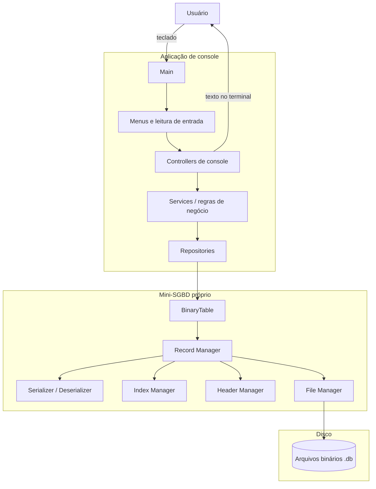
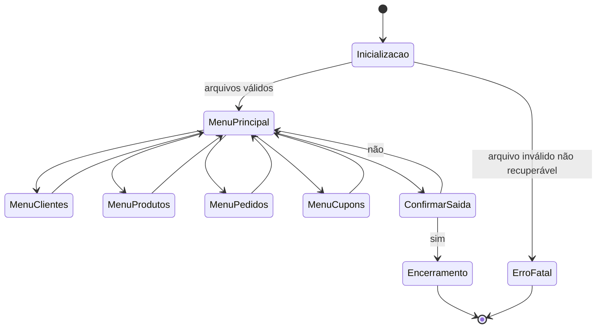
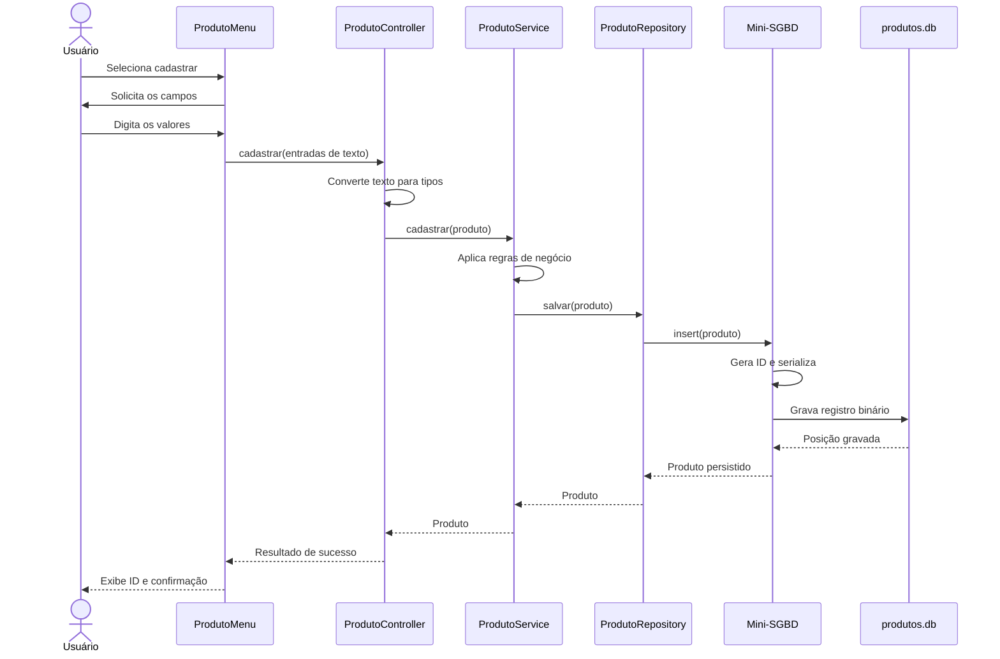
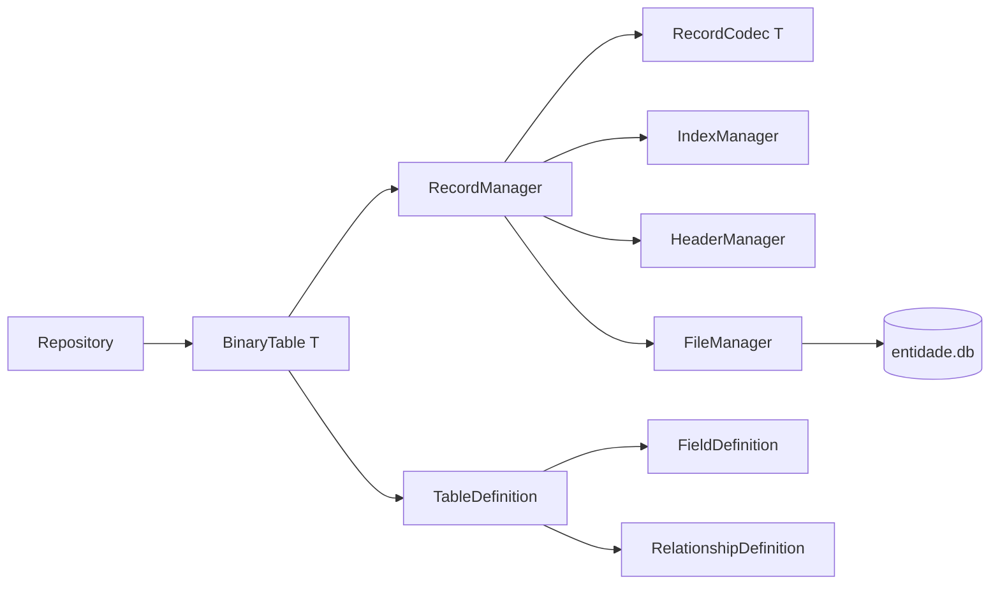
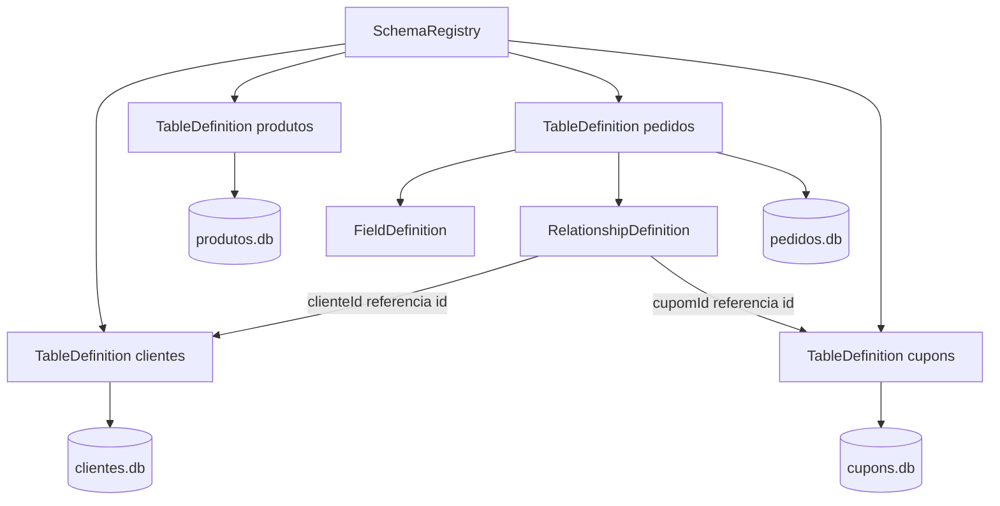
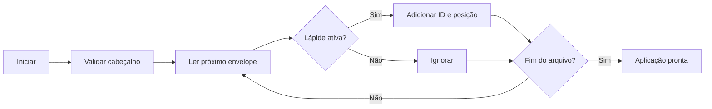
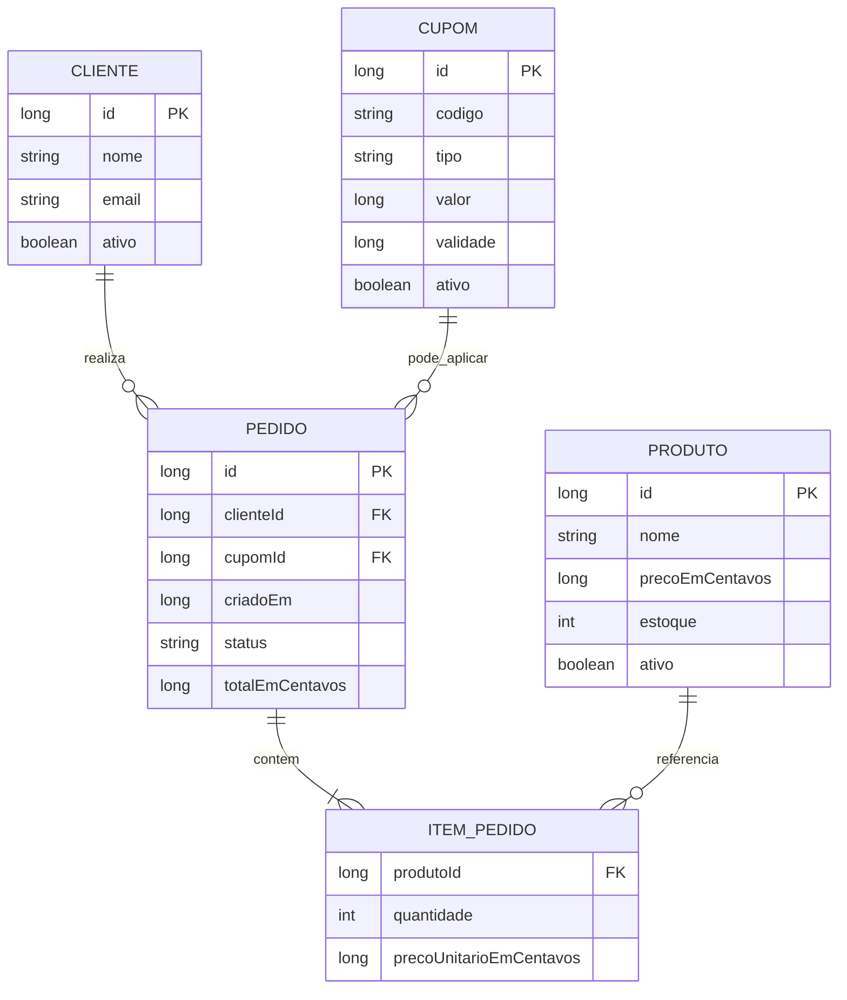
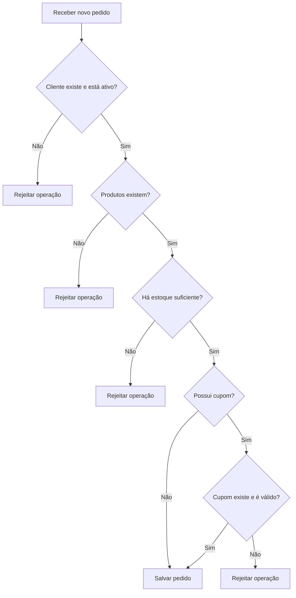

# Arquitetura do Projeto - Aplicação de Console sem Frameworks

> Arquitetura de referência para a Fase 1: aplicação executada no terminal, sem interface web, sem frameworks e sem SGBD pronto.

## 1. Objetivo e restrições

A aplicação será executada no console e organizada em camadas. Toda interação ocorrerá por menus de texto. A persistência será implementada pela equipe em arquivos binários.

### Restrições

- Não utilizar React ou outra interface web.
- Não utilizar Spring, Quarkus, Hibernate, Express ou frameworks equivalentes.
- Não utilizar MySQL, PostgreSQL, SQLite, MongoDB ou outro SGBD pronto.
- Utilizar somente recursos da linguagem e sua biblioteca padrão.
- Persistir os dados em arquivos binários próprios.
- Implementar cabeçalho, serialização, lápide e exclusão lógica.
- Separar interface, regras de negócio e persistência.

### Linguagem sugerida

Os exemplos consideram **Java 21 sem frameworks**, compilado com `javac` e executado com `java`. A arquitetura também pode ser aplicada a C, C++, C# ou outra linguagem permitida pela disciplina.

## 2. Visão geral



Fluxo das dependências:

```text
Main -> Menu -> Controller -> Service -> Repository -> Mini-SGBD -> arquivo .db
```

Nenhuma camada inferior chama a interface de console. Assim, regras de negócio e persistência podem ser testadas sem simular teclado e terminal.

## 3. Responsabilidades das camadas

| Camada | Responsabilidade |
|---|---|
| `Main` | montar dependências, inicializar arquivos e iniciar o menu principal |
| `Menu` | exibir opções, ler entradas e controlar navegação |
| `Controller` | converter texto em dados, chamar casos de uso e apresentar resultados |
| `Service` | validar e executar regras de negócio |
| `Repository` | oferecer operações de persistência usando entidades do domínio |
| Mini-SGBD | controlar bytes, registros, índices, cabeçalhos e lápides |
| Arquivos `.db` | armazenar permanentemente os dados |

### Exemplo de separação

- Perguntar o nome do produto: `ProdutoMenu`.
- Converter o preço digitado: `ProdutoController`.
- Validar que o preço é positivo: `ProdutoService`.
- Salvar e localizar produtos: `ProdutoRepository`.
- Transformar o produto em bytes: `ProdutoCodec`.
- Escrever em uma posição do arquivo: `FileManager`.

## 4. Navegação da aplicação



Exemplo do menu:

```text
====================================
          SISTEMA DE VENDAS
====================================
1. Clientes
2. Produtos
3. Pedidos
4. Cupons
0. Sair
Escolha uma opção: _
```

Cada submenu pode seguir o mesmo padrão:

```text
1. Cadastrar
2. Consultar por ID
3. Listar ativos
4. Alterar
5. Excluir
0. Voltar
```

## 5. Fluxo de uma operação

Exemplo: cadastrar produto.



## 6. Tratamento seguro das entradas

O console recebe texto, portanto toda conversão pode falhar. A interface deve repetir a pergunta em vez de encerrar o programa.

```java
public int lerInteiro(String mensagem) {
    while (true) {
        System.out.print(mensagem);
        String texto = scanner.nextLine().trim();
        try {
            return Integer.parseInt(texto);
        } catch (NumberFormatException e) {
            System.out.println("Valor inválido. Digite um número inteiro.");
        }
    }
}
```

Regras importantes:

- usar uma única instância de `Scanner` durante a aplicação;
- preferir `nextLine()` e converter explicitamente;
- não colocar regras de negócio dentro do código de leitura;
- distinguir erro de entrada, regra de negócio e persistência;
- nunca mostrar detalhes internos ou rastreamento de pilha ao usuário comum.

## 7. Arquitetura do mini-SGBD



### `BinaryTable<T>`

Fachada genérica utilizada pelos repositórios:

```java
public interface BinaryTable<T> {
    T insert(T entity) throws StorageException;
    Optional<T> findById(long id) throws StorageException;
    List<T> findAll() throws StorageException;
    T update(long id, T entity) throws StorageException;
    boolean delete(long id) throws StorageException;
}
```

### `RecordCodec<T>`

Uma implementação por entidade define a ordem exata dos campos:

```java
public interface RecordCodec<T> {
    byte[] serialize(T entity) throws IOException;
    T deserialize(long id, byte[] payload) throws IOException;
}
```

### Demais componentes

- `RecordManager`: executa o CRUD físico.
- `FileManager`: abre, posiciona, lê e escreve no arquivo.
- `HeaderManager`: cria, valida e atualiza o cabeçalho.
- `IndexManager`: mantém `ID -> posição do registro`.
- `StorageException`: traduz erros de baixo nível para uma exceção da camada.

## 8. Definição de tabelas, campos e relacionamentos

### Estratégia adotada

A Fase 1 utilizará uma solução intermediária:

- o mecanismo de armazenamento será genérico;
- cada entidade terá uma tabela lógica e um arquivo `.db` próprio;
- o esquema será declarado explicitamente no código;
- os serializadores continuarão específicos por entidade;
- os relacionamentos serão descritos como metadados;
- os Services garantirão a integridade referencial.

Essa estratégia demonstra conceitos reais de um SGBD sem exigir SQL, criação dinâmica de tabelas, planejador de consultas ou `JOIN` automático.



### `TableDefinition`

Representa a definição de uma tabela lógica:

```java
public record TableDefinition(
    short typeId,
    String name,
    int schemaVersion,
    List<FieldDefinition> fields,
    List<RelationshipDefinition> relationships
) {}
```

Cada tabela deve possuir:

- `typeId` único, também armazenado no cabeçalho do arquivo;
- nome único;
- versão do esquema;
- chave primária obrigatória chamada `id`;
- lista ordenada de campos;
- lista de relacionamentos.

### `FieldDefinition`

```java
public record FieldDefinition(
    int order,
    String name,
    FieldType type,
    boolean nullable,
    boolean primaryKey
) {}
```

Tipos iniciais suportados:

```java
public enum FieldType {
    BOOLEAN,
    INT,
    LONG,
    STRING,
    DATE_TIME,
    MONEY_CENTS
}
```

A ordem dos campos faz parte do formato binário. Alterá-la sem mudar `schemaVersion` tornaria registros antigos incompatíveis.

### `RelationshipDefinition`

```java
public record RelationshipDefinition(
    String localField,
    String referencedTable,
    String referencedField,
    RelationType relationType,
    DeletePolicy onDelete
) {}
```

Políticas recomendadas:

```java
public enum DeletePolicy {
    RESTRICT,  // impede excluir enquanto houver referências
    SET_NULL,  // remove a referência, se o campo aceitar nulo
    NO_ACTION  // Service específico decide o comportamento
}
```

Não implementar `CASCADE` na Fase 1. Exclusões em cascata aumentam o risco de apagar logicamente muitos registros por engano.

### Exemplo de esquema de produto

```java
public final class ProdutoSchema {
    public static final TableDefinition TABLE = new TableDefinition(
        (short) 2,
        "produtos",
        1,
        List.of(
            new FieldDefinition(0, "id", FieldType.LONG, false, true),
            new FieldDefinition(1, "nome", FieldType.STRING, false, false),
            new FieldDefinition(2, "descricao", FieldType.STRING, true, false),
            new FieldDefinition(3, "precoEmCentavos", FieldType.MONEY_CENTS, false, false),
            new FieldDefinition(4, "estoque", FieldType.INT, false, false),
            new FieldDefinition(5, "ativo", FieldType.BOOLEAN, false, false)
        ),
        List.of()
    );

    private ProdutoSchema() {}
}
```

### Exemplo de relacionamento de pedido

```java
new RelationshipDefinition(
    "clienteId",
    "clientes",
    "id",
    RelationType.MANY_TO_ONE,
    DeletePolicy.RESTRICT
)
```

Isso documenta que muitos pedidos podem pertencer a um cliente. O metadado descreve a relação; a validação efetiva permanece no `PedidoService`.

### Registro central dos esquemas

```java
public final class SchemaRegistry {
    private final Map<String, TableDefinition> byName;
    private final Map<Short, TableDefinition> byTypeId;

    public SchemaRegistry(List<TableDefinition> tables) {
        // Validar nomes, IDs, campos, chaves e referências duplicadas.
    }

    public TableDefinition requireByName(String name) { /* ... */ }
    public TableDefinition requireByTypeId(short typeId) { /* ... */ }
}
```

Na inicialização, o registro deve verificar:

- nomes e `typeId` únicos;
- exatamente uma chave primária por tabela;
- nomes e ordens de campos únicos;
- campos locais dos relacionamentos existentes;
- tabelas e campos referenciados existentes;
- compatibilidade de tipos entre as duas pontas da relação.

### Limite importante

O esquema é declarativo, mas está compilado na aplicação. A Fase 1 não terá comandos como:

```text
CREATE TABLE
ALTER TABLE
DROP TABLE
SELECT ... JOIN
```

Alterar campos exige aumentar `schemaVersion` e decidir como tratar arquivos antigos. Durante a Fase 1, recomenda-se fechar o modelo antes de produzir dados definitivos.

## 9. Formato físico dos arquivos

Um arquivo por entidade:

```text
data/
├── clientes.db
├── produtos.db
├── pedidos.db
└── cupons.db
```

Os nomes devem ser ajustados ao DER definitivo.

### Cabeçalho fixo de 64 bytes

```text
[magic:4]
[version:2]
[entityType:2]
[nextId:8]
[activeCount:8]
[deletedCount:8]
[reserved:32]
```

| Campo | Função |
|---|---|
| `magic` | identificar o arquivo, por exemplo `MSDB` |
| `version` | identificar a versão do formato |
| `entityType` | impedir o uso do codec incorreto |
| `nextId` | gerar o próximo identificador |
| `activeCount` | contar registros ativos |
| `deletedCount` | contar registros removidos |
| `reserved` | permitir evolução sem mudar o tamanho do cabeçalho |

### Registro de tamanho variável

```text
[lapide:1]
[payloadLength:4]
[id:8]
[updatedAt:8]
[recordVersion:4]
[payload:N]
```

- `lápide = 0`: registro ativo.
- `lápide = 1`: registro excluído.
- `payloadLength`: quantidade de bytes da carga.
- `id`: identificador do registro.
- `updatedAt`: instante da última gravação.
- `recordVersion`: versão do formato da entidade.

Recomenda-se usar `RandomAccessFile`, `DataInputStream`, `DataOutputStream`, `ByteArrayInputStream` e `ByteArrayOutputStream`, todos da biblioteca padrão do Java.

## 10. Serialização

| Tipo | Representação |
|---|---|
| `boolean` | 1 byte |
| `int` | 4 bytes |
| `long` | 8 bytes |
| data/hora | `long` em epoch milliseconds |
| texto UTF-8 | tamanho `int` + bytes UTF-8 |
| lista | quantidade `int` + itens |
| opcional | indicador `boolean` + valor quando presente |

Valores monetários devem ser armazenados como `long` em centavos. Isso evita erros de ponto flutuante.

Exemplo de carga de produto:

```text
[nomeLength][nome UTF-8]
[descricaoLength][descricao UTF-8]
[precoEmCentavos:8]
[quantidadeEstoque:4]
[ativo:1]
```

O codec deve ler na mesma ordem em que escreve.

## 11. Operações físicas

### Inserir

1. Obter `nextId`.
2. Serializar a entidade.
3. Ir ao fim do arquivo.
4. Gravar envelope e carga.
5. Atualizar `ID -> posição` no índice.
6. Atualizar o cabeçalho.

### Consultar

1. Localizar a posição no índice.
2. Ler o envelope.
3. Confirmar ID, tamanho e lápide ativa.
4. Ler e desserializar a carga.

### Excluir logicamente

1. Localizar a posição pelo ID.
2. Substituir somente o byte da lápide por `1`.
3. Remover o ID do índice.
4. Decrementar ativos e incrementar removidos.

### Alterar

Para simplificar e reduzir risco de corrupção:

1. marcar o registro antigo como excluído;
2. gravar a nova versão no fim do arquivo;
3. manter o mesmo ID;
4. atualizar o índice para a nova posição.

Essa abordagem deixa espaço morto no arquivo, recuperável posteriormente por compactação.

## 12. Índice de busca

Na Fase 1, utilizar um índice primário em memória:

```java
Map<Long, Long> primaryIndex = new HashMap<>();
```

O mapa relaciona o ID à posição inicial do registro. Ele é reconstruído quando a aplicação inicia:



Uma árvore B ou arquivo de índice persistente pode ser evolução posterior. O `HashMap` é suficiente enquanto o conjunto de dados couber em memória.

## 13. Modelo lógico de referência



Como não existe SGBD externo para impor chaves estrangeiras, o Service deve verificar se os IDs relacionados existem antes de salvar.

### Integridade referencial

Os relacionamentos utilizam IDs, equivalentes a chaves estrangeiras:

```text
Pedido.clienteId       -> Cliente.id
Pedido.cupomId         -> Cupom.id
ItemPedido.produtoId   -> Produto.id
```

Exemplo do fluxo para criar um pedido:



Políticas iniciais sugeridas:

| Relação | Política |
|---|---|
| Cliente com pedidos | impedir exclusão; permitir desativação |
| Produto usado em pedidos | impedir exclusão; permitir desativação |
| Cupom usado em pedidos | preservar o histórico; permitir desativação |
| Pedido e seus itens | armazenar itens dentro da carga do pedido na Fase 1 |

O pedido deve armazenar o preço unitário praticado em cada item. Consultar novamente o preço atual do produto alteraria incorretamente pedidos históricos.

### Consultas relacionadas sem `JOIN`

O mini-SGBD não executará `JOIN`. Um Service monta a visão completa em memória:

```java
public PedidoDetalhado consultarDetalhes(long pedidoId) {
    Pedido pedido = pedidoRepository.findByIdOrThrow(pedidoId);
    Cliente cliente = clienteRepository.findByIdOrThrow(pedido.clienteId());
    List<Produto> produtos = carregarProdutosDosItens(pedido.itens());
    return new PedidoDetalhado(pedido, cliente, produtos);
}
```

Essa operação é uma composição de consultas por ID, e não uma responsabilidade da interface de console.

## 14. Composição manual das dependências

Sem framework, o `Main` cria e conecta os objetos explicitamente:

```java
public final class Main {
    public static void main(String[] args) {
        Path dataDirectory = Path.of("data");

        RecordCodec<Produto> codec = new ProdutoCodec();
        BinaryTable<Produto> table = new FileBinaryTable<>(
            dataDirectory.resolve("produtos.db"), codec, EntityType.PRODUTO
        );
        ProdutoRepository repository = new FileProdutoRepository(table);
        ProdutoService service = new ProdutoService(repository);
        ProdutoController controller = new ProdutoController(service);

        try (ConsoleApplication app = new ConsoleApplication(controller)) {
            app.run();
        }
    }
}
```

Isso é injeção de dependência manual: o objeto recebe suas dependências pelo construtor, sem precisar de contêiner ou framework.

## 15. Estrutura sugerida de pastas

```text
projeto/
├── README.md
├── docs/
│   ├── ARQUITETURA_CONSOLE.md
│   ├── casos-de-uso.md
│   └── modelo-de-dados.md
├── src/
│   ├── Main.java
│   └── br/edu/projeto/
│       ├── console/
│       │   ├── ConsoleApplication.java
│       │   ├── InputReader.java
│       │   ├── MainMenu.java
│       │   ├── ClienteMenu.java
│       │   ├── ProdutoMenu.java
│       │   ├── PedidoMenu.java
│       │   └── CupomMenu.java
│       ├── controller/
│       ├── domain/
│       │   ├── model/
│       │   └── exception/
│       ├── service/
│       ├── repository/
│       ├── schema/
│       │   ├── SchemaRegistry.java
│       │   ├── TableDefinition.java
│       │   ├── FieldDefinition.java
│       │   ├── FieldType.java
│       │   ├── RelationshipDefinition.java
│       │   ├── RelationType.java
│       │   ├── DeletePolicy.java
│       │   ├── ClienteSchema.java
│       │   ├── ProdutoSchema.java
│       │   ├── PedidoSchema.java
│       │   └── CupomSchema.java
│       └── minidb/
│           ├── BinaryTable.java
│           ├── FileBinaryTable.java
│           ├── RecordManager.java
│           ├── FileManager.java
│           ├── HeaderManager.java
│           ├── IndexManager.java
│           ├── codec/
│           ├── format/
│           └── exception/
├── test/
│   └── br/edu/projeto/
├── data/
│   └── README.md
└── scripts/
    ├── compile.bat
    └── run.bat
```

## 16. Compilação sem ferramentas externas

Exemplo no Windows PowerShell:

```powershell
New-Item -ItemType Directory -Force out
javac -encoding UTF-8 -d out (Get-ChildItem src -Recurse -Filter *.java).FullName
java -cp out Main
```

O projeto pode incluir scripts para facilitar, mas deve continuar compilável somente com o JDK.

## 17. Erros e encerramento

### Categorias

- `InputException`: entrada inválida do usuário.
- `BusinessException`: violação de regra de negócio.
- `NotFoundException`: entidade inexistente.
- `StorageException`: falha de arquivo, formato ou serialização.

O Controller converte essas falhas em mensagens amigáveis. Erros graves podem ser registrados em `logs/application.log` usando `java.util.logging`, que pertence à biblioteca padrão.

Ao sair:

1. terminar a operação atual;
2. sincronizar escritas pendentes;
3. fechar arquivos;
4. fechar o `Scanner` uma única vez;
5. apresentar mensagem de encerramento.

## 18. Consistência dos dados

- Somente o mini-SGBD manipula bytes.
- Validar `magic`, versão, tipo e tamanhos ao abrir o arquivo.
- Rejeitar carga negativa ou maior que o restante do arquivo.
- Permitir somente uma escrita por arquivo de cada vez.
- Escrever primeiro o registro e depois atualizar cabeçalho e índice.
- Reconstruir o índice ao iniciar.
- Utilizar arquivo temporário durante compactação.
- Criar cópia de segurança antes de substituir um arquivo de dados.
- Comparar `entityType` e `schemaVersion` do cabeçalho com o `TableDefinition` antes de ler registros.
- Recusar a abertura de uma tabela cujo esquema seja incompatível, em vez de interpretar bytes incorretamente.

## 19. Testes mínimos

Mesmo sem framework, testes podem ser classes Java executáveis com métodos auxiliares de asserção. Se a disciplina permitir JUnit, ele facilita os testes, mas não é necessário para a aplicação funcionar.

### Mini-SGBD

- criar e validar cabeçalho;
- inserir, reiniciar e consultar;
- serializar textos com acentos;
- excluir e não retornar o registro;
- alterar mantendo o mesmo ID;
- reconstruir índice;
- detectar arquivo truncado;
- gerar IDs únicos;
- impedir leitura além do fim do arquivo.
- rejeitar `typeId` diferente do esperado;
- rejeitar versão de esquema incompatível.

### Esquemas e relacionamentos

- detectar tabelas com nomes ou `typeId` duplicados;
- detectar campos com nomes ou ordens duplicadas;
- exigir exatamente uma chave primária;
- detectar relacionamento para tabela inexistente;
- detectar incompatibilidade entre tipos relacionados;
- impedir exclusão quando a política for `RESTRICT`;
- garantir que consultas detalhadas preservem dados históricos.

### Aplicação

- opção de menu inválida não encerra o programa;
- número malformado solicita nova entrada;
- regras de negócio rejeitam dados inválidos;
- cancelar uma operação retorna ao menu;
- sair fecha todos os recursos.

## 20. Ordem de implementação

```mermaid
flowchart LR
    A[1. Definir entidades e casos de uso] --> B[2. Declarar tabelas e relações]
    B --> C[3. Especificar formato binário]
    C --> D[4. Implementar codecs]
    D --> E[5. Implementar mini-SGBD]
    E --> F[6. Testar CRUD e reinicialização]
    F --> G[7. Criar repositories]
    G --> H[8. Criar services e integridade]
    H --> I[9. Criar controllers e menus]
    I --> J[10. Testar o fluxo completo]
```



## 21. Critérios de pronto

- [ ] Aplicação compila apenas com o JDK.
- [ ] Nenhum framework ou SGBD externo é utilizado.
- [ ] Menus não contêm regras de negócio nem acesso a arquivos.
- [ ] Cabeçalho e registros possuem formato documentado.
- [ ] CRUD funciona em arquivos binários.
- [ ] Exclusão utiliza lápide.
- [ ] Índice é reconstruído após reiniciar.
- [ ] Cada entidade possui um `TableDefinition` e um arquivo próprio.
- [ ] Campos possuem nome, tipo, ordem e nulabilidade documentados.
- [ ] Relacionamentos estão declarados em `RelationshipDefinition`.
- [ ] Services validam referências antes de gravar.
- [ ] Políticas de exclusão preservam o histórico.
- [ ] Versão e tipo do esquema são conferidos ao abrir o arquivo.
- [ ] Erros de entrada não encerram inesperadamente a aplicação.
- [ ] Arquivos são fechados corretamente.
- [ ] DCU e DER correspondem ao domínio definitivo.
- [ ] README ensina a compilar e executar.

## 22. Resumo para apresentação

> A solução é uma aplicação de console feita sem frameworks. Os menus cuidam somente da interação com o usuário; Controllers convertem as entradas; Services aplicam regras de negócio; e Repositories acessam nosso mini-SGBD. Cada entidade corresponde a uma tabela lógica, definida por metadados de campos e relacionamentos, e possui um arquivo binário próprio. O mini-SGBD grava cabeçalho, registros, IDs e lápides, enquanto um índice em memória localiza cada registro. Os Services validam as referências entre tabelas e montam consultas relacionadas sem depender de `JOIN`. Essa separação torna o sistema mais fácil de entender, testar e evoluir.

---

### Observação

Cliente, produto, pedido e cupom são entidades de referência recuperadas do contexto anterior. Antes da entrega, ajustar nomes, atributos, relacionamentos e casos de uso ao enunciado integral e ao modelo aprovado pelo grupo.
